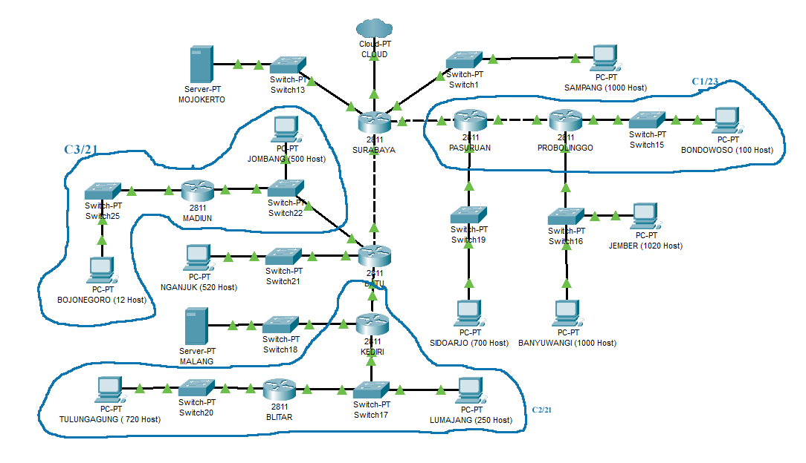

## Lapres Praktikum Jaringan Komputer Modul 3

---

Anggota :

1. 05111840000039 - Sitti Chofifah
2. 05111840000139 - Dohan Pranata W.

---

---

VLSM

**Perhitungan VLSM**

Langkah 1 : Menentukan jumlah subnet pada topologi TPC

Langkah 2 : Menentukan jumlah alamat IP yang dibutuhkan oleh tiap subnet
dan lakukan labelling netmask berdasarkan jumlah IP yang dibutuhkan.

Langkah 3 : Hitung pembagian IP berdasarkan NID dan netmask
192.168.32.0/19 menggunakan pohon

### **Konfigurasi VLSM di CISCO PACKET TRACER ( CPT )**

Langkah 1 :Membuat topologi di CPT sesuai gambar di soal praktikum

Langkah 2 : Tambahkan port NM-2FE2W pada semua router terlebih dahulu
khusus untuk router Surabaya tambahkan port NM-4E

Langkah 3 : Sambungkan cable sesuai dengan topologi yang ada di soal
praktikum

Langkah 4 : Atur IP untuk masing-masing interface yang ada di setiap
device sesuai dengan pembagian subnet yang ada di pohon VLSM.

Cara mengatur interface pada router :

a. Klik router yang ingin di atur

b. Masuk ke menu Config

c. Klik interface

d. Pilih nama interface sesuai dengan kabel yang ingin di sambungkan.
Contoh : FastEthernet0/0).

e. Masukkan alamat IP dan subnet mask dari subnet interface tersebut.

Cara mengatur interface pada PC :

a. Klik PC yang ingin di atur

b. Masuk ke menu Desktop

c. Klik IP Configuration

d. Masukkan alamat IP dan subnet mask dari subnet interface tersebut

Contoh mengatur IP pada interface Surabaya yang mengarah ke Sampang

Lakukan hal yang sama untuk mengatur alamat IP interface pada setiap
device yang ada dalam topologi

Note : Cloud diberikan IP Tuntap

IP untuk DMZ diambil dari NID DMZ kelompok masing-masing

Langkah 5 : Melakukan routing pada setiap router yang ada. Routing dapat
dilakukan dengan cara :

a. Klik pada router yang ingin di routing

b. Masuk ke menu Config

c. Klik Routing

d. Pilih Static

e. Masukkan network, mask, dan next hop setelah itu klik tombol Add

Contoh routing pada router Surabaya

Pada static routing dibutuhkan default routing agar router dapat
mengirimkan paket sesuai dengan tujuan.

Contoh routing pada Batu membutuhkan default routing

Agar semua subnet dapat saling terhubung, tambahkan static routing
sebagai berikut :

1.  Pada Surabaya

> 192.168.36.112/28 via 192.168.36.98
> 192.168.40.0/22 via 192.168.36.98
> 192.168.38.0/23 via 192.168.36.98
> 192.168.36.100/30 via 192.168.36.98
> 192.168.44.0/22 via 192.168.36.98
> 192.168.37.0/24 via 192.168.36.98
> 10.151.83.100/30 via 192.168.36.98
> 192.168.36.108/30 via 192.168.36.105
> 192.168.36.128/25 via 192.168.36.105
> 192.168.52.0/22 via 192.168.36.105
> 192.168.56.0/21 via 192.168.36.105

2.  Pada Batu

> 0.0.0.0/0 via 192.168.36.97
> 192.168.36.112/28 via 192.168.38.2
> 192.168.44.0/22 via 192.168.36.102
> 192.168.37.0/24 via 192.168.36.102
> 10.151.83.100/30 via 192.168.36.102

3.  Pada Madiun

> 0.0.0.0/0 via 192.168.38.1

4.  Pada Kediri

> 0.0.0.0/0 via 192.168.36.101
> 192.168.44.0/22 via 192.168.37.2

5.  Pada Blitar

> 0.0.0.0/0 via 192.168.37.1

6.  Pada Pasuruan

> 0.0.0.0/0 via 192.168.36.106
> 192.168.56.0/21 via 192.168.36.109
> 192.168.36.128/25 via 192.168.36.109

7.  Pada Probolinggo

> 0.0.0.0/0 via 192.168.36.110

CIDR

Perhitungan CIDR

Pohon CIDR

---

SUBNET NID NETMASK BROADCAST
A1 192.168.36.112/28 255.255.255.240 192.168.36.127
A2 192.168.40.0/22 255.255.252.0 192.168.43.255
A3 192.168.38.0/23 255.255.254.0 192.168.39.255
A4 192.168.39.96/30 255.255.255.254 192.168.39.99
A5 192.168.36.100/30 255.255.255.252 192.168.36.103
A6 192.168.44.0/22 255.255.252.0 192.168.47.255
A7 192.168.37.0/24 255.255.255.0 192.168.37.255
A8 192.168.52.0/22 255.255.252.0 192.168.55.255
A9 192.168.56.0/21 255.255.248.0 192.168.63.255
A10 192.168.36.104/30 255.255.255.252 192.168.36.107
A11 192.168.36.108/30 255.255.255.252 192.168.36.111
A12 192.168.36.128/25 255.255.255.128 192.168.36.255
A13 192.168.48.0/22 255.255.252.0 192.168.51.255

---

Untuk Setting UML nya Mohon maaf mas masih belom bisa
